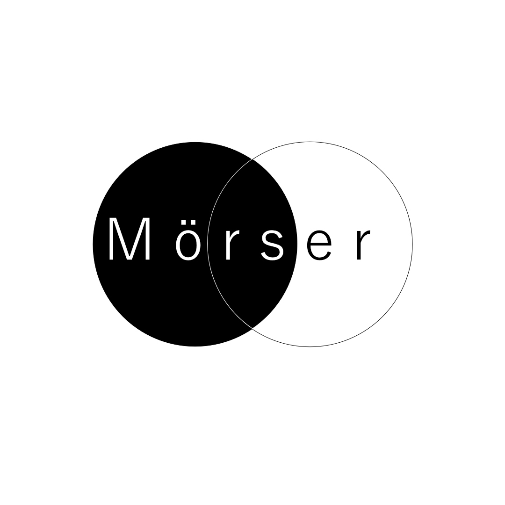

<div align="center">
<h2>Moerser - Automatic morse system
</h2>


<br>
</div>


[](https://github.com/BennerLukas/Moerser/issues)
[](https://github.com/BennerLukas/Moerser/network)
[](https://github.com/BennerLukas/Moerser/stargazers)
[](https://github.com/BennerLukas/Moerser/blob/main/LICENSE)


## Usage
1. Install the Moerser-Package via 
    ```bash
    python setup.py develop
    ```
2. Run the Programm by executing:
    ```bash
    python ./src/Moerser/interface/gui.py
    ```
## Idea

## Team

## Technology
