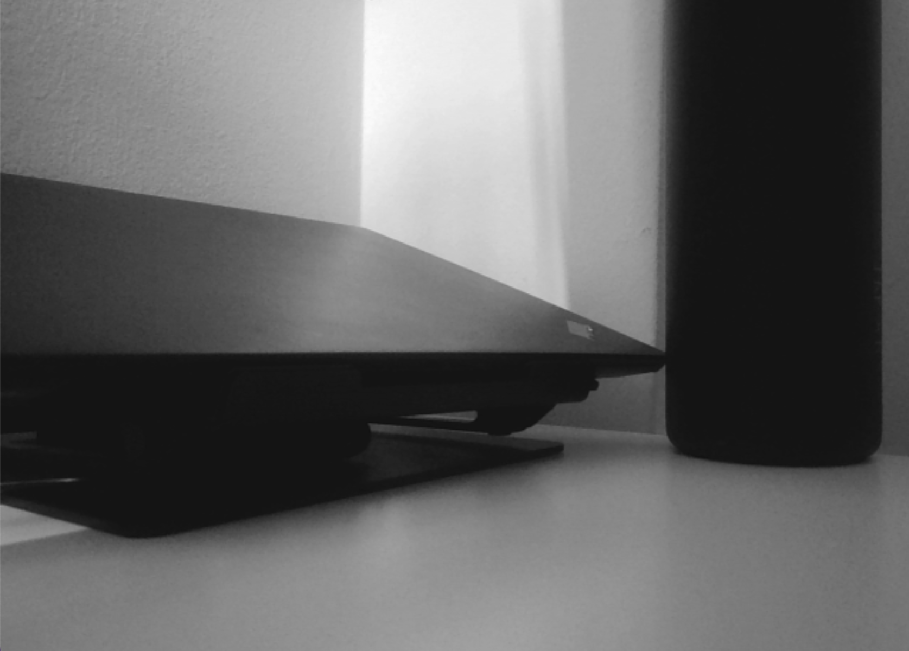
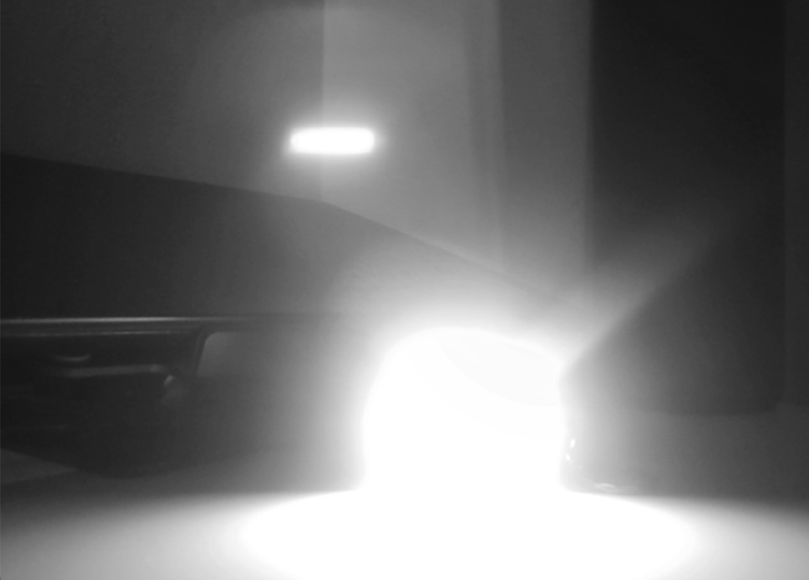
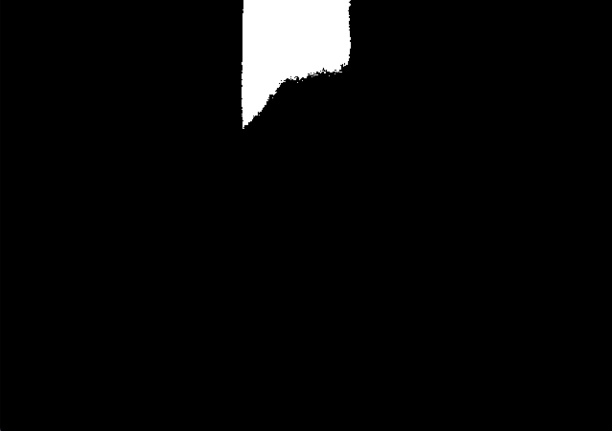

<div align="center">
<h2>Moerser - Automatic morse system
</h2>


<br>
</div>

<br>
<div align="center">

[](https://github.com/BennerLukas/Moerser/issues)
[](https://github.com/BennerLukas/Moerser/network)
[](https://github.com/BennerLukas/Moerser/stargazers)
[](https://github.com/BennerLukas/Moerser/blob/main/LICENSE)


</div>

## Usage
1. Install the Moerser-Package via 
    ```bash
    python setup.py develop
    ```
2. Run the Programm by executing:
    ```bash
    python ./src/Moerser/interface/gui.py
    ```
> Note: if you want to use a different camera source, change the camera number in periphery.py>Camera>openCamera(NewNumber)

For a demo video click [here](https://youtu.be/9dcBtRabC2M).
## User Interface


A Graphical User Interface (GUI) makes the application of moerser a more streamlined experience. Upon starting the tool, the first frame will be automatically set as the brightness baseline. Should users wish to use another frame as the underlying baseline, then the "sync" function can be used. 

"clear" flushes the current interpreter and inititates new variables to start fresh. Interpreted sequences appear in a text box under "total Input" at the bottom of the screen. Any interpreted sequence is also decoded and presented in "Translation". The counters indicate how many frames that exceed the brightness threshold were counted. 

## Standard Morse Notation


### Moerser Specific Notation
A challenge of this project has been to come up with a notation that codifies six scenarios using only 2 signals (white/black or bright/dark).
We settled for the following adaptiation of the above international morse code:
    
    Brightness:
    1-4 --> Dit (short)
    5-7 --> Dah (long)
    8+  --> Delete last seq

    Darkness:
    1-3 --> Next sequence (e.g. dit or dah)
    4-6 --> Next letter in word
    7+  --> Next word

Depending on the length of bright frames, we can differentiate between dits and dahs. Errors are displayed using a placeholder ("_") and can be corrected through deleting the last sequence (8+ frames) and resending it.

A sentence consists of multiple words. These are put together through different letters. Letters are a compilation of signals. This Sentence segmentation is again implemented by interpreting the various length of dark frames.
## Image Preprocessing
To find out whether a frame is to be interperted as dark or as bright, images have to be preprocessed appropriately. To make images comparable in terms of brightness, a single channel (e.g. grayscale) is deemed adequate. A major difficulty however, is recognizing the brightness of a light source accurately while disregarding the relative brightness of the surrounding.

### Naive Approach
A simple and intuitive approach is transforming images to grayscale first and then calculating the average brightness to compare with the baseline. If the average is greater than the baseline, the frame is bright, otherwise it is dark.

<!-- image -->

This approach works, although it is not very reliable as bright objects in the immediate surroundings can falsify the average brightness results.

### Binary Approach

<!-- image -->

Another approach was to transform the image to black and white only. For that we applied a threshold to the grayscale image in which any pixel that was below the cut-off of  220 is set to black (0), otherwise it is set to white (250). That way the whole image, with exception of minor objects, is black. Any light source shone directly at the camera is above the cut-off and thus whate in the otherwise black frame. This method proved itself reliable and was therefore implemented in the moerser tool.

    thresh, bw_frame = cv2.threshold(grey_frame, 220, 255, cv2.THRESH_BINARY)


### Comparison

Type | No light             |  Light |
:-------------------------:|:-------------------------:|:-------------------------:
Grayscale |   |  
Binary/BW|   |  

While the average brightness changes in both types, the binary approach is more robust to changes in the background, e.g. shadows, objects moved into the frame etc. don't affect the average brightness in the BW frame whereas the grayscale frame is affected significantly. 